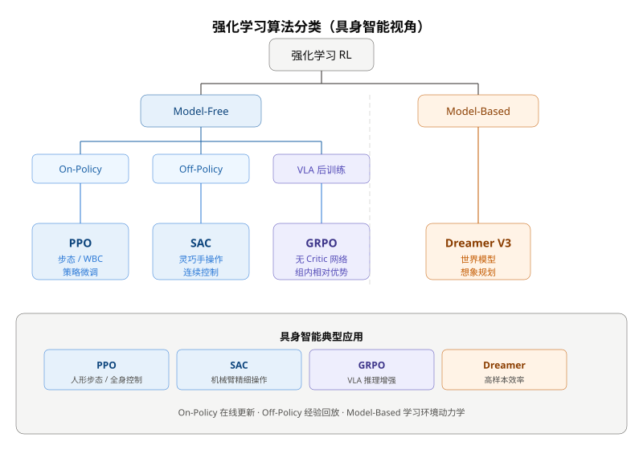
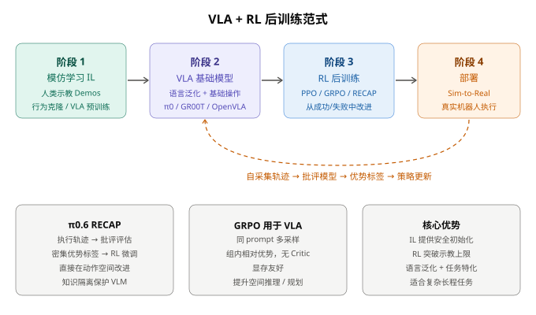

# 具身智能：VLA 与强化学习深度学习

> **类型**：理论 · **层级**：L1 · **状态**：稳定 · **更新**：2026-07-03  
> **关联**：[01-VLA算法入门](./01-VLA算法入门.md) · [π0.5 项目实践](../projects/π0.5双臂L6折纸VLA与SAC微调项目实践.md)

> 本文是 VLA 与强化学习的**进阶资料**，承接 [01-VLA算法入门](./01-VLA算法入门.md) 中的基础概念，沿 RT-2 → OpenVLA → π0 → π0.5 主线展开，系统梳理架构演进、四条技术路线、RL 算法基础，以及 VLA + RL 后训练范式。

---

## 目录

1. [VLA 基础](#一vla-基础)
2. [VLA 深入：四条技术路线](#二vla-深入四条技术路线)
3. [强化学习基础](#三强化学习基础)
4. [VLA + RL 结合：后训练范式](#四vla--rl-结合后训练范式)
   - [完整示例：抓取-放置 RL 后训练](#43-完整示例机械臂抓取-放置任务的-rl-后训练)
5. [技术全景对比](#五技术全景对比)
6. [四条路线速查](#六四条路线速查)

---

## 一、VLA 基础

### 1.1 什么是 VLA？

VLA（Vision-Language-Action）是将**视觉感知（Vision）**、**语言理解（Language）**和**动作执行（Action）**三者融合的端到端模型架构。它让机器人能够理解自然语言指令、感知环境，并输出物理控制信号。



**数据流**：多模态输入（图像/视频、语言指令、本体感知）→ 视觉/语言编码 → 多模态融合 → 动作解码 → 关节角/末端位姿等控制信号。

### 1.2 模型演进谱系



| 模型 | 年份 | 核心特点 |
|------|------|----------|
| RT-2 | 2022 | 首个 VLA；VLM 动作 Token 化 |
| OpenVLA | 2023 | 开源；Llama2 + DINOv2 + SigLIP |
| π0 | 2024 | Flow Matching 连续动作头；50Hz |
| π0.5 | 2024 | 知识隔离；多任务泛化 |
| RDT-1B | 2024 | 统一动作空间 + DiT 扩散 |
| GR00T N1 系列 | 2025 | 双系统；VLM + DiT |
| π0.6 / ACoT-VLA | 2025 | 从经验学习 / 动作思维链 |

### 1.3 早期代表性模型速览

**RT-2（2022, Google）** — 第一个真正意义的 VLA：将 PaLI-X 视觉语言大模型的动作输出离散化为 Token，以文本 token 的形式预测关节角度。优点是充分利用 VLM 的语言泛化能力；缺点是 token 化的动作精度有限，且推理频率低（~3Hz）。

**π0（2024, Physical Intelligence）** — 引入 Flow Matching 动作头，用连续归一化流代替离散 token，输出高频（50Hz）、高精度的连续动作。PaliGemma 语言骨干提供语义理解，Flow Matching 头负责精确运动控制，是"慢语言脑 + 快运动脑"的早期范本。

**GR00T N1/N1.5（2025, NVIDIA）** — 双系统架构：系统 2（VLM）负责慢速语义规划，系统 1（DiT）负责快速连续动作生成。支持多形态机器人，可通过 Isaac Sim 合成数据大规模训练。

**π0.6 / ACoT-VLA** — 分别代表"从经验中 RL 自我改进"和"在动作空间做 Chain-of-Thought 推理"两条最新路线，详见下文深入拆解。

---

## 二、VLA 深入：四条技术路线

从 π0.5 之后，RDT-1B、GR00T N1 系列、π0.6、ACoT-VLA 分别代表四条不同的演进方向：

| 路线 | 代表模型 | 核心创新 |
|------|----------|----------|
| 多机器人统一 | RDT-1B | 统一动作空间 + DiT 扩散<sup>①</sup> |
| 工业级双系统 | GR00T N1 系列 | VLM 慢思考 + DiT 快执行<sup>②</sup> |
| 经验驱动改进 | π0.6 | 知识隔离 + RECAP 后训练 |
| 动作空间推理 | ACoT-VLA | EAR + IAR 动作思维链 |

> ① **DiT 扩散**：应用于动作生成的 Diffusion Transformer（DiT）架构，将扩散模型和 Transformer 结合，从噪声逐步「还原」出多模态、连续的高维机器人动作分布；可表达多样解（multi-modal），并支持多机器人在统一动作空间下高效泛化。
>
> ② **DiT 快执行**：以 DiT 作为机器人「快反应」决策单元，区别于上层慢速 VLM 规划。VLM 理解环境和指令后输出高层意图，DiT 将其转化为高频、高精度的连续电机控制流，扮演「快动作脑」。

---

### 2.1 RDT-1B（清华大学，2024.10）

#### 核心问题：双臂操作为什么难？

双臂协调任务（折叠衣物、拧瓶盖、装配零件）存在两个根本挑战：

1. **动作多模态性** — 同一任务有多种可行执行方式，普通回归模型无法建模这种分布
2. **数据异构性** — 不同机器人的关节数量、动作空间定义完全不同，简单合并多机器人数据会导致负迁移

RDT-1B 的贡献在于同时解决了这两个问题。

#### 架构：Diffusion + DiT 骨干



**统一动作空间**是 RDT-1B 最核心的创新。不同机器人的原始动作向量（关节角、末端位姿、底盘速度等）被统一映射到一个**物理可解释的通用向量**里，包含末端执行器的位置/速度、关节角/角速度、以及轮式运动分量。不同机器人只需填充自己有的分量，多余的分量置零——这样就可以在同一个模型里混合训练几十个不同平台的数据，而不会发生负迁移。

扩散策略（Diffusion Policy）用于建模双臂动作的多模态分布。RDT 构建在扩散模型之上以有效表示多模态性，并创新性地设计了可扩展的 Transformer 来处理多模态输入的异构性。对于 RDT-1B，骨干网络由 **28 层、32 头的 DiT** 构成，隐层大小 2048，总参数量约 **12 亿**。[arXiv](https://arxiv.org/abs/2410.07864)

RDT 接收语言指令、最多三个视角的 RGB 图像、控制频率（如有）以及本体感知作为输入，预测接下来 **64 步**的机器人动作。在真实机器人上展现出对未见物体和场景的零样本泛化能力，仅用 1~5 次示教就能学会新技能。[Hf-mirror](https://hf-mirror.com/robotics-diffusion-transformer/rdt-1b)

**与 π0 系列的区别**：RDT-1B 没有单独的 VLM 语言骨干，而是把语言、视觉、动作都扔进同一个 DiT 里联合处理，架构更简洁，但语言理解的深度不如带 LLM 骨干的 VLA。

---

### 2.2 GR00T N1 / N1.5 / N1.6（NVIDIA，2025）

目前工业界影响力最大的开源人形机器人基础模型系列，与 Isaac Sim 工作流直接相关。

#### 双系统架构（Dual-System）

GR00T N1 是一个 VLA 模型，采用双系统架构：视觉语言模块（**系统 2**）通过视觉和语言指令理解环境，随后的扩散 Transformer 模块（**系统 1**）实时生成流畅的电机动作。两个模块紧密耦合，联合端到端训练。



灵感来源于人类认知原理：

- **系统 1（快）** — 快速思考的动作模型，模拟反射或直觉
- **系统 2（慢）** — 慢速思考模型，用于深思熟虑的决策制定

系统 2 由 VLM 驱动，对环境和指令进行推理以规划动作；系统 1 将这些规划转化为精确、连续的机器人运动。[NVIDIA Newsroom](https://nvidianews.nvidia.com/news/nvidia-isaac-gr00t-n1-open-humanoid-robot-foundation-model-simulation-frameworks)

#### 训练数据金字塔

| 层级 | 数据类型 | 特点 |
|------|----------|------|
| 底层（量大） | 仿真合成数据 | DreamGen 生成轨迹 / 视频生成模型 |
| 顶层（量小） | 真实遥操作数据 | 与机器人本体强相关 |

关键思路：越往上数据量越少，但与机器人本体的相关性越强。[Medium Review](https://medium.com/correll-lab/a-review-paper-gr00t-n1-an-open-foundation-model-for-generalist-humanoid-robots-nvidia-march-734c82c38e70)

#### N1 → N1.5 → N1.6 的演进

GR00T N1.6 使用了 NVIDIA 内部的 **Cosmos-2B VLM** 变体作为视觉语言骨干，支持灵活分辨率、按原始宽高比编码图像而无需填充。此外，DiT 扩展为 **32 层**（N1.5 的 16 层的两倍），并移除了 N1.5 中 VLM 之后的 4 层 Transformer 适配器，改为在预训练时**解冻 VLM 顶部 4 层**。[NVIDIA Research](https://research.nvidia.com/labs/gear/gr00t-n1_6/)

演进核心：**VLM 骨干越来越强**（公开模型 → 内部定制 Cosmos）→ **DiT 动作头越来越深**（16 层 → 32 层）→ **两系统耦合越来越紧**（适配器 → 直接解冻共享参数）。

**工作关联**：GR00T N1.5 直接在 Unitree G1 和傅里叶 GR-1 上部署验证。其 Isaac Sim 仿真数据生成管道（DreamGen 合成数据）正是 Sim-to-Real 工作的上游，值得深入研究。

---

### 2.3 π0.6（Physical Intelligence，2025.11）

π0.6 的核心主题是**"从经验中学习"** — 不只是模仿示教，还能从自己的成功与失败中自我改进。

#### 架构改进：相比 π0.5

- 图像 token：**双向注意力**（与 π0.5 相同）
- 文本 token：**因果注意力**
- 动作 token：**双向注意力**
- **知识隔离训练**：VLM 骨干预测 FAST 动作 token 和多模态网络数据；动作专家预测连续动作，且动作专家的梯度**不会反向传播**到主 VLM 骨干
- 推理效率：5 步去噪 + 3 个相机输入，单张 H100 生成一个动作块仅需 **63ms** [Model Card](https://website.pi-asset.com/pi06star/PI06_model_card.pdf)

**知识隔离（Knowledge Insulation）** 是关键工程解法：VLM 骨干和动作专家各自独立优化，避免动作学习干扰语言理解能力，解决 π0 系列一直面临的梯度冲突问题。

#### RECAP：从失败中学习

π0.6 最重要的贡献是 **RECAP**（Retrospective Critique and Policy improvement）：

```
执行轨迹 → 批评模型评估每步质量 → 密集优势标签 → RL 微调策略
```

思路是：让机器人执行一次，记录整条轨迹（含成功/失败），然后用批评模型评估每个时间步的质量，给出密集的优势标签，再做强化微调。这与 GRPO 的思路本质相同，但**直接在动作空间**上做，而不是语言空间。

---

### 2.4 ACoT-VLA（AgibotTech / CVPR 2026）

参加 ICRA 2026 AGIBot World Challenge 时实际接触过的框架。

#### 先澄清一个常见误解

**三种 CoT 不是同时并行、也不是串联执行的三个子任务。**

架构图上半部分的「语言 CoT / 视觉 CoT / 动作 CoT」是**三种不同的推理路线对比**——论文用来说明：以往 VLA 要么在语言空间做 CoT，要么在视觉空间做 CoT，都有信息损失；ACoT-VLA 选择的是**第三种路线**，且**只走这一条**。

| 你的疑问 | 实际含义 |
|----------|----------|
| 三种链条同时跑？ | **否**。只有动作 CoT（ACoT）在模型内部运行 |
| 各自并行？ | **否**。EAR 与 IAR 是**并行**两条支路，但都在「动作 CoT」这一条路线里 |
| 各自串联？ | **部分对**。整体是 **串联**：感知 → 推理 → 动作；推理内部 EAR、IAR **并行**后汇合 |

#### 核心思路：推理直接在动作空间进行

ACoT-VLA 提出**动作思维链（ACoT）**范式：推理过程本身是一系列**结构化的粗粒度动作意图**（例如「先移动到杯子上方 → 下降抓取 → 平移到目标上方 → 松手放置」），用来引导最终精细动作输出。



#### 三种 CoT 范式对比（路线选型，非同时执行）

| 范式 | 推理形式 | 局限 | ACoT-VLA 是否采用 |
|------|----------|------|-------------------|
| 语言 CoT | 预测子任务文本（如「先抓取」） | 间接、粒度粗，文本→动作有 gap | **不采用** |
| 视觉 CoT | 生成目标状态图像 | 与动作空间异构，缺执行精度 | **不采用** |
| **动作 CoT（ACoT）** | 直接在动作空间推理 | 与最终输出同构，精度高 | **采用** |

#### 架构图下半部分：单次推理的数据流（串联 + 内部并行）

```
输入（图像 + 语言指令 + 本体感知）
        ↓
   VLM 骨干（共享特征，理解「把杯子放到桌上」）
        ↓
   ┌────┴────┐
   ↓         ↓          ← EAR 与 IAR 并行，都在动作空间推理
  EAR       IAR
（显式粗轨迹） （隐式动作先验）
   └────┬────┘
        ↓
   ACoT 推理链（粗轨迹 + 隐先验 联合条件化）
        ↓
   动作头 → 输出精细关节角 / 末端位姿
```

**EAR（Explicit Action Reasoner）** — 显式动作推理器。简单来说，EAR 就是用来“想清楚这个任务要分几步、每步大致应该怎么做”的模块。它通常是个轻量级的 Transformer 结构，输入当前观测和命令，输出**可读的粗粒度轨迹意图**——比如「先移动到杯子上方 → 下降抓取 → 平移 → 松手」这样中间步骤的动作草图。这些结果既能被人类看懂，模型自己也能据此组织后续精细动作。

**IAR（Implicit Action Reasoner）** — 即隐式动作推理器。它的核心作用是通过交叉注意力机制，自动从当前环境感知、VLM提取的特征中学习到一组“隐式的动作先验”——也就是模型内部对动作的优化偏好或经验总结，这些表征很难用文本直接描述，但对提升后续精细动作生成非常关键。

简单理解，IAR 的职责是：对输入信息做一次“内部动作合理性验证”——它并不会输出明显、人类能看懂的动作步骤，而是隐式建模动作空间中哪些动作更可行、更稳定、更符合当前上下文。IAR 的输出作为“软约束”参与后续动作组合，与 EAR 生成的显式轨迹信息在 ACoT 推理链中结合，最终提升智能体精细控制的准确性与鲁棒性。

**总之，IAR 就像一个“动作推理的裁判+建议官”：实时评估/补充当前粗颗粒意图在现实中的可行性与优劣，使生成的最终精细动作不仅合理，还能更好应对噪声和未见环境。**

两者**并行**从 VLM 特征出发，**汇合**成 ACoT 推理链，再**串联**条件化动作头。动作头只负责最后一步：把「想清楚了什么」变成「具体怎么动」。

#### 举例：指令「把红色杯子放到托盘上」

| 阶段 | 语言 CoT 会怎么做（ACoT 不用） | ACoT-VLA 实际怎么做 |
|------|-------------------------------|---------------------|
| 推理 | 输出文本：「1.找杯子 2.抓取 3.放置」 | EAR 输出粗动作序列：`(approach) → (grasp) → (move) → (release)` |
| 中间表示 | 文本 token，和电机指令不同构 | 动作 token / 动作向量，与最终输出**同构** |
| 执行 | 文本再映射到动作，易丢精度 | IAR 补充隐式先验 → 动作头直接输出精细轨迹 |

**一句话总结**：ACoT-VLA = **只选动作空间 CoT 这一条路**；内部 **EAR ∥ IAR 并行 → 汇合 → 动作头串联输出**；不是三种 CoT 同时跑。

**基准表现**：LIBERO 98.5% | LIBERO-Plus 84.1% | VLABench 47.4%，在相机视角变化和传感器噪声扰动下展现出显著鲁棒性。

---

## 三、强化学习基础

强化学习的核心是智能体（Agent）通过与环境交互，最大化累积奖励。



### 3.1 核心 RL 算法详解

| 算法 | 类型 | 一句话 | 具身典型场景 |
|------|------|--------|--------------|
| PPO | On-Policy | Clip 限制策略更新幅度，稳定 | 人形步态、WBC |
| SAC | Off-Policy | 最大熵 + 经验回放，样本效率高 | 灵巧手、机械臂力控 |
| GRPO | On-Policy（无 Critic） | 组内相对优势，省显存 | VLA 后训练、推理增强 |
| Dreamer V3 | Model-Based | 世界模型 + 想象规划 | 少样本学复杂技能 |

---

#### 3.1.1 PPO（Proximal Policy Optimization）

**定位**：具身智能最常用的 **on-policy** 算法——每次更新策略时，交互数据必须来自**当前最新策略**，不能用旧策略采样的历史数据（样本利用率低于 off-policy，但收敛更稳）。

**核心机制 — Clip 截断**：

每次更新时，计算新旧策略的动作概率比 $r_t(\theta) = \frac{\pi_\theta(a_t|s_t)}{\pi_{\theta_{old}}(a_t|s_t)}$，乘以优势函数 $A_t$，并对 $r_t$ 做截断（如限制在 $[0.8, 1.2]$），防止策略一次更新幅度过大导致「策略崩溃」。

**具身应用**：DeepMind MuJoCo 双足步态、Unitree 人形机器人全身运动控制（WBC）。

---

#### 3.1.2 SAC（Soft Actor-Critic）

**定位**：最稳定、应用最广的 **off-policy** 算法，特别适合**连续动作空间**（关节角、末端位姿、力矩等）。历史交互数据可存入 Replay Buffer 反复利用，样本效率高。

**核心创新 — 最大熵强化学习**：

不仅最大化累积奖励，还鼓励策略保持高熵（探索性），避免过早收敛到局部最优：

$$J = \mathbb{E}_{(s,a)\sim D} \left[ r(s, a) + \alpha \mathcal{H}(\pi(\cdot|s)) \right]$$

其中 $\alpha$ 为熵权重（可自适应调节），$\mathcal{H}$ 为策略熵。

**网络结构**：

| 组件 | 作用 |
|------|------|
| Actor（策略网络） | 输入状态，输出动作分布 |
| Critic × 2（双 Q 网络） | 估计 $Q(s,a)$，取 min 减轻过估计 |
| 熵系数 $\alpha$ | 自动调节探索强度：早期多探索，后期多利用 |

**关键特性**：

- **Off-policy**：Replay Buffer 存 $(s, a, r, s')$，同一批数据可多次训练
- **对超参数不敏感**：batch size、学习率容忍度较高，适合真机
- **连续控制友好**：输出高斯分布均值+方差，直接采样连续动作

**具身应用**：OpenAI Dactyl 灵巧手、机械臂精细力控、多指操作。

---

#### 3.1.3 GRPO（Group Relative Policy Optimization）

**定位**：DeepSeek 提出，近期引入 **VLA 后训练**。不需要独立 Critic 网络，显存占用低。

**核心机制**：

对同一输入（如同一语言指令 + 图像），用当前策略**采样 G 条**不同动作序列 → 用任务奖励或批评模型给每条打分 → 在**组内**计算相对优势（高于组均值的加强，低于的削弱）→ 更新策略。

**与 PPO / SAC 的区别**：GRPO 的「优势」来自**同 prompt 的多条输出之间的相对比较**，而非 Critic 网络估计的 $V(s)$。

**具身应用**：VLA 空间推理增强、复杂任务规划的后训练微调。

---

#### 3.1.4 Dreamer / DreamerV3

**定位**：**Model-Based RL** 代表——先在隐空间学习「世界模型」（预测 $s_{t+1}$ 和 $r_t$），再在模型「想象」出的轨迹上做策略优化。

**优势**：样本效率极高，少量真实交互即可学会复杂技能。

**具身应用**：仿真中预训练、数据稀缺的真实机器人任务。

---

## 四、VLA + RL 结合：后训练范式



### 4.1 四阶段流程

```
模仿学习（人类示教）→ VLA 基础模型 → RL 后训练 → Sim-to-Real 部署
                              ↑__________________________|
                              自采集轨迹反馈循环
```

| 阶段 | 方法 | 作用 |
|------|------|------|
| 1. 模仿学习 | 行为克隆 / VLA 预训练 | 安全初始化，继承人类行为 |
| 2. VLA 基础模型 | π0 / GR00T / OpenVLA | 语言泛化 + 基础操作能力 |
| 3. RL 后训练 | PPO / GRPO / RECAP | 突破示教上限，从经验改进 |
| 4. 部署 | Sim-to-Real | 真实机器人执行 |

### 4.2 两种典型后训练方法

| 方法 | 流程 | 特点 |
|------|------|------|
| **π0.6 RECAP** | 执行轨迹 → 批评评估 → 密集优势标签 → RL 微调 | 动作空间直接改进；知识隔离保护 VLM |
| **GRPO for VLA** | 同 prompt 多采样 → 组内相对优势 → 策略更新 | 无 Critic；显存友好；提升推理与规划 |

### 4.3 完整示例：机械臂「抓取-放置」任务的 RL 后训练

以下用 **RECAP 风格**（π0.6 思路）走一遍从 IL 到 RL 后训练的完整流程，便于建立直觉。任务：**「把桌面上的红色杯子放到右侧托盘上」**。

#### 阶段 0：问题与动机

| 现象 | 原因 |
|------|------|
| VLA 能抓简单物体，但换视角/轻微遮挡就失败 | 示教数据覆盖不足 |
| 偶尔抓歪、放置时碰倒相邻物体 | 模仿学习只学「怎么做」，不学「怎么做得更好」 |
| 示教者总是成功，模型没见过失败 recovery | IL 无法从失败中学习 |

→ 需要 **RL 后训练**：在 VLA 初始化基础上，用环境反馈进一步改进。

#### 阶段 1：模仿学习预训练（IL）

```
遥操作采集 500 条成功 demo
    ↓
行为克隆 / VLA 预训练（OpenVLA / π0 等）
    ↓
得到基础策略 π₀：能理解语言 + 完成约 70% 成功率的基础抓取
```

#### 阶段 2：部署采集自交互数据

机器人在仿真（Isaac Sim）或真机上**自主执行**（不再纯模仿）：

```
for episode in range(N):
    obs = env.reset()                    # 随机化杯子位置、相机视角、光照
    trajectory = []
    while not done:
        action = π₀(obs, "把红色杯子放到托盘上")
        next_obs, reward, done = env.step(action)
        trajectory.append((obs, action, reward, next_obs))
        obs = next_obs
    save(trajectory)                     # 含成功和失败轨迹
```

**奖励设计（稀疏 + 可选 shaping）**：

| 事件 | 奖励 |
|------|------|
| 成功放入托盘 | +1.0 |
| 杯子掉落 / 碰撞 | -0.5 |
| 每步时间惩罚 | -0.01（鼓励效率） |

#### 阶段 3：批评模型打优势标签（RECAP 核心）

```
对每条 trajectory 的每个时间步 t：
    advantage_t = CriticModel(obs_t, action_t, outcome)
    # 例如：成功 episode 中「接近杯子」的步骤 → 高 advantage
    #       失败 episode 中「抓取前偏移」的步骤 → 低/负 advantage
```

也可用 **GRPO 替代**：同一 `(图像, 指令)` 采样 G 条动作轨迹，按任务成败在组内排名，排名高者 advantage 为正。

#### 阶段 4：RL 微调策略

以 **PPO 或 GRPO** 更新策略（VLA 动作头或 LoRA 层）：

```
L = - E[ min(r_t(θ) · A_t, clip(r_t(θ), 1±ε) · A_t) ]   # PPO
# 或
L = - E[ (reward_i - mean(rewards)) / std(rewards) · log π(a_i|s) ]  # GRPO 组内相对
```

**知识隔离**（π0.6）：只更新动作专家 / 动作头，**冻结 VLM 骨干**，避免语言理解能力被 RL 梯度破坏。

#### 阶段 5：迭代与部署

```
π₀ → 采集 → 批评/奖励 → RL 更新 → π₁ → 再采集 → ... → π_final
                                              ↓
                                    Sim-to-Real 部署
                                    成功率 70% → 90%+
```

#### 单次控制步的数据流（推理时）

```
相机图像 + 关节状态 + 指令「把红色杯子放到托盘上」
        ↓
   VLA 骨干（理解任务）
        ↓
   动作头输出 Δjoint 或 末端位姿（50Hz）
        ↓
   ros2_control / 底层 PD 控制器
        ↓
   机械臂运动 → 新观测 → 循环
```

#### 三种算法在本例中的角色

| 算法 | 在本任务中的用法 |
|------|------------------|
| **SAC** | 若从零训练低层连续控制（如力控抓取），用 SAC + Replay Buffer；VLA 后训练阶段较少直接用 |
| **PPO** | 常用作 VLA 后训练的 RL 优化器，Clip 保证更新稳定 |
| **GRPO** | RECAP 的轻量替代：同场景多采样轨迹，组内比较，无需 Critic 网络 |

#### RL 后训练 vs 纯 IL：一表对比

| 维度 | 纯模仿学习 | IL + RL 后训练 |
|------|-----------|----------------|
| 数据 | 仅人类成功 demo | demo + 自采集成功/失败轨迹 |
| 学习目标 | 复现示教 | 最大化任务奖励 |
| 失败 recovery | 弱 | 可从失败中学习调整 |
| 风险 | 低（行为可预期） | 需约束（仿真预训练、奖励 shaping、知识隔离） |

---

## 五、技术全景对比

| 维度 | VLA（模仿学习主导） | RL 方法 | 两者结合 |
|------|---------------------|---------|----------|
| 数据来源 | 人类示教 Demos | 环境交互奖励 | 示教初始化 + RL 精调 |
| 样本效率 | 高（少量示教即可） | 低（需海量交互） | 较高 |
| 泛化能力 | 强（语言驱动） | 弱（任务特化） | 最强 |
| 安全性 | 继承示教行为 | 需显式约束 | 需约束设计 |
| 典型场景 | 抓取、摆放、操作 | 步态、平衡、导航 | 复杂长程任务 |

---

## 六、四条路线速查

```
RT-2 → OpenVLA → π0 → π0.5          （主线，已掌握）
         ↓
    ┌────┴────┬──────────┬──────────┐
 RDT-1B   GR00T N1   π0.6    ACoT-VLA
 统一空间   双系统    RECAP    动作CoT
 DiT扩散   VLM+DiT   经验学习  EAR+IAR
```

| 选型场景 | 推荐路线 |
|----------|----------|
| 多机器人平台、双臂协调 | RDT-1B |
| 人形机器人、Isaac Sim 生态 | GR00T N1 系列 |
| 已有 VLA 基础、需自我改进 | π0.6 + RECAP |
| 复杂长程任务、需推理链 | ACoT-VLA |
