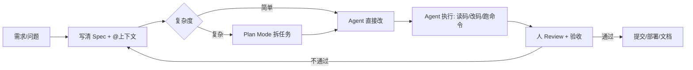
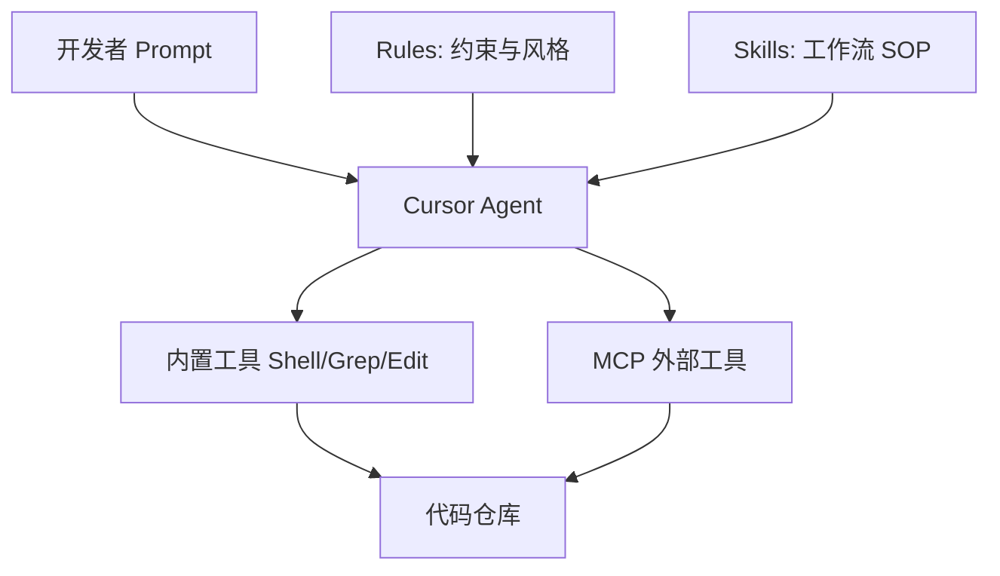
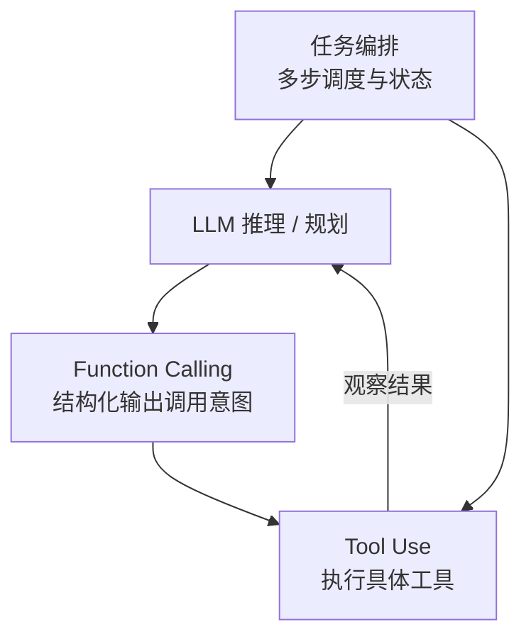

# AI 开发工具 · Cursor 全流程与 Agent 模式

> **类型**：面试 · **层级**：L2 · **状态**：稳定 · **更新**：2026-07-10  
> **用途**：梳理 Cursor 做 AI Coding 的完整工作流；理解 Agent 核心模式（Function Calling、任务编排、Tool Use）；结合机器人/具身场景举例。  
> **关联**：[面试知识储备](../面试知识储备.md) · [运控双方向深度学习路线](./运控双方向深度学习路线.md) · [面试复盘](../面试复盘.md)

---

## 如何使用本文

1. **自查**：遮住「详细流程」，只看「一句话定义」能否讲清 Cursor 工作流
2. **面试**：先讲「人怎么用工具」，再讲「Agent 底层三种模式」，最后举一个机器人落地案例
3. **实操**：按 §2 的流程走一遍真实任务（如写 ROS2 节点、修 CI、做数采脚本）
4. **对标岗位**：地平线「机器人应用工程师」等要求 *AI 工具熟练 + Agent 模式实践* 的岗位，§6 案例可直接口述

---

## 目录

- [1. 总览：AI Coding 在开发中的位置](#1-总览ai-coding-在开发中的位置)
- [2. Cursor 全流程（从需求到交付）](#2-cursor-全流程从需求到交付)
- [3. 持久化能力：Rules / Skills / MCP](#3-持久化能力rules--skills--mcp)
- [4. 任务规划：Plan Mode 与 Agent 分解](#4-任务规划plan-mode-与-agent-分解)
- [5. Agent 核心模式](#5-agent-核心模式)
  - [5.1 Function Calling（函数调用）](#51-function-calling函数调用)
  - [5.2 Tool Use（工具使用）](#52-tool-use工具使用)
  - [5.3 任务编排（Task Orchestration）](#53-任务编排task-orchestration)
- [6. 真实场景案例](#6-真实场景案例)
- [7. 面试快答](#7-面试快答)

---

# 1. 总览：AI Coding 在开发中的位置

### 一句话定义

**AI Coding** = 用 LLM + IDE 工具链，把「自然语言意图」转成「可运行、可审查、可迭代的代码与文档」，人负责 **目标、约束、验收**。

### 口述描述

传统开发：人写每一行代码。AI Coding：人写 **规格（Spec）+ 上下文（Context）+ 验收标准**，AI 生成初稿，人做 **Review / 调试 / 集成**。  
Cursor 的定位是 **Agent-first IDE**——不只是补全，而是能 **读仓库、跑命令、改多文件、调用外部工具** 的编码 Agent。

### 与传统 Copilot 补全的对比

| 维度 | 行内补全（Copilot 类） | Cursor Agent（Agent 模式） |
|------|------------------------|----------------------------|
| 输入 | 当前文件 + 光标上下文 | 自然语言任务 + 全仓库 + Rules/Skills |
| 输出 | 下一行/下一段代码 | 多文件 diff、终端命令、测试、文档 |
| 规划 | 无显式规划 | Plan → Execute → Verify 循环 |
| 工具 | 基本无 | Shell、Grep、MCP、浏览器、子 Agent |
| 适用 | 局部实现 | 功能开发、重构、Debug、脚手架 |

### 典型工作流（一张图）



---

# 2. Cursor 全流程（从需求到交付）

## 2.1 阶段 0：工程上下文准备

| 动作 | 说明 | 机器人场景举例 |
|------|------|----------------|
| 打开正确仓库 | Agent 的 `cwd` 决定能读到什么 | `ros2_ws/src/my_robot_app` |
| 配置 `.cursor/rules/` | 持久约束：代码风格、ROS 命名、禁止事项 | 「ROS2 用 rclpy，节点名 snake_case」 |
| 配置 Skills | 可复用工作流（见 §3） | `jupyter-notebook`、`create-hook` |
| 接入 MCP | 连外部系统（Linear、DB、仿真 API） | 查 Jira issue、读仿真日志 |
| `.gitignore` / 密钥 | 避免 Agent 读入 `.env`、大模型权重 | 不把 `checkpoints/` 喂给上下文 |

**原则**：上下文质量 > 提示词长度。`@file` / `@folder` 比粘贴大段代码更稳。

---

## 2.2 阶段 1：写清任务（Spec）

好的任务描述 = **目标 + 约束 + 验收 + 边界**。

```markdown
【目标】为 differential_drive 机器人新增 ROS2 Nav2 对接节点
【约束】Python rclpy；不改动现有 launch 结构；兼容 Humble
【验收】`ros2 topic echo /cmd_vel` 能收到 Nav2 输出；单元测试通过
【边界】不做 SLAM 参数调优；不提交 .env
```

**反模式**：「帮我写个导航」——缺少平台、接口、验收，Agent 会猜。

---

## 2.3 阶段 2：选模式

| 模式 | 何时用 | 特点 |
|------|--------|------|
| **Ask** | 只问不改、读代码、架构讨论 | 只读，安全 |
| **Agent** | 明确要实现/修复 | 可写文件、跑终端 |
| **Plan** | 多文件、架构未定、有多种方案 | 先出方案，人确认后再写 |
| **Debug** | 有报错、复现步骤、日志 | 围绕运行时证据排查 |

**经验法则**：
- 改 1～2 个文件 → Agent 直接干  
- 新模块 / 重构 / 不确定技术选型 → 先 Plan  
- 线上或仿真偶发失败 → Debug + 贴日志/复现步骤  

---

## 2.4 阶段 3：Agent 执行循环

Cursor Agent 内部大致循环：

```
理解任务 → 检索上下文（Grep/Read/@引用）
        → 制定子步骤（隐式或显式 Todo）
        → 调用工具（写文件 / Shell / MCP）
        → 根据输出调整（lint、测试失败则修）
        → 汇报结果
```

**人应介入的时机**：
- 大范围删除或改 API 前
- 安装新依赖、改 CI、动数据库前
- diff 看不懂或动到未预期的文件时
- 第一次跑通前的「方向对不对」

---

## 2.5 阶段 4：验收与沉淀

| 验收项 | 命令/动作 |
|--------|-----------|
| 编译/构建 | `colcon build`, `cmake --build` |
| 静态检查 | linter、类型检查 |
| 单元/集成测试 | `pytest`, `launch_test` |
| 仿真冒烟 | Gazebo / Isaac Sim 跑一条轨迹 |
| 真机（可选） | 小速度、急停在手边 |

**沉淀**：把反复说的约束写进 **Rules**；把重复流程写成 **Skill**（见 §3）。

---

## 2.6 全流程 Checklist（可打印）

```
□ 仓库与分支正确
□ Rules/Skills 已就位
□ 任务含目标、约束、验收
□ 用 @ 引用了关键文件/目录
□ 复杂任务走了 Plan
□ Review diff（尤其删除和依赖）
□ 本地 build + test 通过
□ 有价值的新约定写回 Rules/Skill
```

---

# 3. 持久化能力：Rules / Skills / MCP

## 3.1 Rules（规则）— 项目的「长期记忆」

**位置**：`.cursor/rules/*.mdc`  
**作用**：每次对话自动注入，约束 Agent 行为。

```markdown
---
description: ROS2 Python 节点规范
globs: **/*.py
alwaysApply: false
---

- 使用 rclpy，节点类继承 Node
- 话题名用 snake_case，与现有 pkg 保持一致
- 不在节点内硬编码 IP；从参数服务器读取
```

| 类型 | `alwaysApply` | 适用 |
|------|---------------|------|
| 全局规范 | `true` | 提交信息格式、安全红线 |
| 文件级 | `false` + `globs` | `**/*.cpp`、`**/launch/*.py` |

**面试话术**：Rules 解决「每次都要重复叮嘱」的问题，相当于 **编码规范的程序化**。

---

## 3.2 Skills（技能）— 可复用工作流

**位置**：
- 个人：`~/.cursor/skills/<skill-name>/SKILL.md`
- 项目：`.cursor/skills/<skill-name>/SKILL.md`

**结构**：

```
my-skill/
├── SKILL.md          # 必需：frontmatter + 步骤说明
├── reference.md      # 可选：详细参考
└── scripts/          # 可选：可执行脚本
```

**frontmatter 示例**：

```yaml
---
name: ros2-nav-bringup
description: >-
  为本仓库创建 Nav2 bringup launch 与参数模板。
  在用户提到导航、Nav2、bringup 时使用。
---
```

**与 Rules 的区别**：

| | Rules | Skills |
|---|-------|--------|
| 触发 | 自动（globs/always） | Agent 根据 description 判断是否读取 |
| 内容 | 约束、禁止、风格 | 分步流程、领域知识、脚本 |
| 类比 | 公司制度 | 岗位 SOP / Playbook |

**机器人项目可写的 Skill 示例**：
- `sim-to-real-checklist`：仿真→真机排查步骤  
- `mujoco-ros-bridge`：MuJoCo 与 ROS2 桥接模板  
- `dataset-export`：数采 bag → LeRobot 格式  

---

## 3.3 MCP（Model Context Protocol）— 接外部世界

**作用**：让 Agent 调用 **IDE 外的工具**（ issue 跟踪、数据库、文档站、自定义 API）。

```
Agent ←→ MCP Server ←→ 外部系统（Jira / Slack / 仿真服务 / 知识库）
```

**典型用途**：
- 读设计文档、API Schema  
- 在 Linear 创建/查询任务  
- 触发远程 CI、查构建日志  

**与 Tool Use 的关系**：MCP 把外部能力 **标准化成 Tool**，Agent 通过同一套 Tool Use 接口调用（见 §5.2）。

---

## 3.4 三者协作关系



---

# 4. 任务规划：Plan Mode 与 Agent 分解

## 4.1 为什么要任务规划

LLM 一次生成有 **上下文窗口** 和 **注意力** 限制。复杂任务若不分步，容易：
- 漏文件、漏测试  
- 架构半途中改主意  
- 无法并行、难以 Review  

**任务规划** = 把「大目标」拆成 **可验证的小步**，每步有输入、输出、完成标准。

---

## 4.2 Plan Mode（Cursor 内置）

**流程**：
1. 用户描述目标 → Agent **只读**分析仓库  
2. 输出方案：文件清单、依赖、风险、可选技术路线  
3. 人确认 / 修改 → 切 Agent 执行  

**适合**：新功能模块、跨包重构、「有多种合法实现」的需求。

**不适合**：单行 typo、明确到文件和函数名的 bug fix。

---

## 4.3 Agent 隐式分解（Todo / 子 Agent）

Agent 模式下常见行为：
- 内部维护 **Todo 列表**（多步任务）  
- 复杂探索用 **子 Agent**（如 `explore` 搜仓库、`shell` 跑命令）  
- **并行**读多文件、多路搜索  

**人如何配合**：
- 在 Prompt 里写「先列计划，再执行」强制显式规划  
- 大任务拆成多个对话轮次，每轮一个可合并的 PR 粒度  

---

## 4.4 任务分解模板（机器人应用）

以「机械臂抓取流水线」为例：

| 步骤 | 产出 | 验收 |
|------|------|------|
| 1. 接口设计 | Topic/Service/Action 表 | 与现有 stack 命名一致 |
| 2. 感知节点 | 检测 + 位姿发布 | 仿真中稳定发布 `PoseStamped` |
| 3. 规划 | MoveIt2 配置 + 规划客户端 | 无碰撞规划成功率 > 95% |
| 4. 执行 | 状态机 + Action 客户端 | 完整 pick 流程跑通 |
| 5. 异常 | 超时、重试、降级 | 抓取失败 3 次后上报 |

在 Cursor 中可 **一轮 Plan 出表**，再 **每步开一个 Agent 会话** 实现，降低单次 diff 风险。

---

# 5. Agent 核心模式

> 以下三种模式是 **现代 Agent（含 Cursor、Claude、OpenAI Assistants、具身 VLA 上层规划）** 的共用抽象。面试时建议：**先讲定义 → 再讲协作关系 → 最后举机器人例子**。

## 5.0 三者关系总览



| 模式 | 一句话 | 谁负责 |
|------|--------|--------|
| **Function Calling** | 模型输出 **结构化 JSON**：要调哪个函数、参数是什么 | LLM |
| **Tool Use** | 运行时 **真正执行** 函数/工具，把结果塞回上下文 | Runtime / IDE / MCP |
| **任务编排** | **多步调度的状态机**：先感知再规划再执行，失败分支 | Orchestrator（框架或 Agent 自身） |

**关键区别（面试常考）**：
- Function Calling 是 **接口协议**（模型侧）  
- Tool Use 是 **执行语义**（运行时侧）  
- 任务编排是 **控制流**（哪一步、何时、失败怎么办）  

---

## 5.1 Function Calling（函数调用）

### 定义

LLM 不直接「手搓 API 请求」，而是生成符合 Schema 的 **工具调用请求**，由运行时解析并执行。

### 典型 Schema（OpenAI / 通用风格）

```json
{
  "name": "get_robot_pose",
  "arguments": {
    "frame_id": "base_link",
    "timeout_sec": 2.0
  }
}
```

### 在 Cursor 中的体现

- Agent 选择内置工具：`Read`、`Grep`、`Shell`、`StrReplace`…  
- 每次工具调用 ≈ 一次 Function Call + Tool Use  
- MCP 工具同样以 **function schema** 注册  

### 设计要点（自己写 Agent 时）

1. **函数粒度**：太细 → 步数爆炸；太粗 → 模型难填参  
2. **描述清晰**：`description` 要写清何时用、参数含义  
3. **幂等与超时**：机器人/硬件调用必须考虑重试与安全  
4. **输出截断**：大段日志要摘要后再喂回 LLM  

### 口述例子

> 「用户说：查一下当前机械臂关节角。LLM 不猜数值，而是 function call `get_joint_states(joint_names=[...])`，运行时调 ROS2 service，把结果 JSON 返回，LLM 再组织成自然语言。」

---

## 5.2 Tool Use（工具使用）

### 定义

拿到 Function Calling 的意图后，**运行时执行** 对应工具，将 **Observation**（成功结果或错误）追加到对话历史，供模型下一步推理。

### 循环（ReAct 风格）

```
Thought → Action(tool, args) → Observation → Thought → ...
```

### 工具类型谱系

| 类型 | 例子 | 风险 |
|------|------|------|
| 只读 | 读文件、Grep、查文档 | 低 |
| 可写 | 改代码、写配置 | 中（需 Review） |
| 执行 | Shell、编译、启动仿真 | 中高 |
| 外部 | MCP、HTTP、数据库 | 高（权限与密钥） |
| 物理 | 发 `/cmd_vel`、机械臂使能 | **最高**（需安全层） |

### Cursor 内置 Tool Use 映射

| 用户可见能力 | 底层 |
|--------------|------|
| 「帮我搜一下哪里用了 `MoveGroup`」 | Grep Tool |
| 「跑 colcon build」 | Shell Tool |
| 「改这个 launch 文件」 | Read + StrReplace |
| 「查 Linear 上这个 bug」 | MCP Tool |

### 机器人安全层（与 VLA 动作安全同源思想）

在 Tool Use 与真机之间加 **守门员**：
- 速度/力矩限幅  
- 工作空间 AABB  
- 急停与 watchdog  
- 高风险 tool 需人确认（Cursor 的 allowlist / 用户点批准）  

---

## 5.3 任务编排（Task Orchestration）

### 定义

把多个 Function Call / Tool Use **按依赖与状态** 组织成 workflow：顺序、并行、条件分支、重试、人工卡点。

### 编排层次

| 层次 | 实现 | 例子 |
|------|------|------|
| **单 Agent 内循环** | LLM 自主决定下一步 tool | Cursor Agent 修 bug |
| **显式 Todo / 计划** | 计划列表驱动 | Plan Mode、TodoWrite |
| **多 Agent** | 子 Agent 分工 | explore + shell + 主 Agent 汇总 |
| **外部编排器** | LangGraph、Temporal、状态机 | 产线机器人任务流 |
| **ROS2 状态机** | SMACH / 自建 FSM | pick→place→charge |

### 编排 vs 单次 Function Call

- **单次 FC**：回答「现在关节角多少」  
- **编排**：「巡检三个工位 → 每个工位拍照 → 检测异常 → 汇总报告 → 异常则导航到近处复检」  

### 失败策略（机器人必备）

| 策略 | 说明 |
|------|------|
| 重试 | 网络/规划瞬时失败 |
| 退避 | 指数退避避免打满 CPU |
| 降级 | 高精度规划失败 → 笛卡尔直线 |
| 分支 | 检测为空 → 换视角再拍 |
| 上报 | 超过 N 次失败 → 通知上层 Agent / 人 |

### 与 Cursor 的对应

- **短编排**：一个 Agent 会话 + Todo  
- **长编排**：Cursor SDK `Agent.create` + 多轮 `send`，或 Cloud Agent 跑在长任务上  
- **CI 编排**：SDK `Agent.prompt` 在 GitHub Action 里做自动 review/fix  

---

# 6. 真实场景案例

## 6.1 案例 A：用 Cursor 开发 ROS2 巡检节点（AI Coding 全流程）

### 背景

地平线 RDK / 自研底盘：需要 **订阅相机 + 发布检测结果 + 异常时停车**。

### 操作实录（可面试口述）

| 步骤 | 人在 Cursor 做什么 | Agent 做什么 |
|------|-------------------|--------------|
| 1 | `@src/perception` `@package.xml` 写 Spec | 读现有包结构 |
| 2 | 确认 Plan：新节点名、topic 表 | 输出文件清单与接口设计 |
| 3 | Agent 模式：「按 Plan 实现」 | 写 `.py`、改 `setup.py`、补 launch |
| 4 | 终端 `colcon build` | Shell 执行，失败则根据 stderr 修 |
| 5 | Review diff，加 Rule「本包 image 话题固定为 /camera/color」 | — |
| 6 | 仿真录 bag 冒烟 | 人验证，Agent 可写 pytest |

### 体现的 Agent 模式

- **Function Calling**：Agent 选择 `Read`/`Write`/`Shell`  
- **Tool Use**：真正编译、grep 找接口  
- **任务编排**：Plan 拆步 → 实现 → 构建 → 修错循环  

---

## 6.2 案例 B：LLM 任务规划 + ROS2 Tool（Function Calling + Tool Use）

### 架构

```
用户自然语言: "去 A 区货架检查缺货"
        ↓
LLM Planner（Function Calling）
        ↓
┌───────────────────────────────────────┐
│ navigate_to(pose_a)                   │
│ capture_image(camera=front)           │
│ detect_shelf_stock(image) → Tool/VLM  │
│ if low_stock: report_to_mqtt(...)     │
│ return_to_dock()                      │
└───────────────────────────────────────┘
        ↓
ROS2 Action / Service 实现每个 function
```

### 伪代码（Planner 侧）

```python
TOOLS = [
    {
        "name": "navigate_to",
        "description": "导航到地图坐标系下的目标位姿",
        "parameters": {
            "type": "object",
            "properties": {
                "x": {"type": "number"},
                "y": {"type": "number"},
                "yaw": {"type": "number"}
            },
            "required": ["x", "y", "yaw"]
        }
    },
    {
        "name": "capture_image",
        "description": "触发相机采集一帧并返回路径",
        "parameters": {"type": "object", "properties": {"camera": {"type": "string"}}}
    },
    # ...
]

# LLM 返回 tool_calls → runtime 执行 ROS2 action → 结果塞回 messages
```

### 任务编排层

用 **状态机** 管物理世界的不确定性：

```
IDLE → NAVIGATING → CAPTURING → ANALYZING
                      ↓ fail ×3
                   REPOSITION → CAPTURING
                      ↓ fail
                   ABORT & REPORT
```

**面试亮点**：LLM 负责 **高层语义与工具选择**；状态机负责 **时序、安全、重试**——与 [面试知识储备](../面试知识储备.md) §2 Agent+状态机架构一致。

---

## 6.3 案例 C：Cursor Skills 固化「Sim-to-Real 排查」

### 问题

每次仿真 OK、真机抖，都要重复问 Agent「怎么排查」。

### 做法

在项目 `.cursor/skills/sim2real-debug/SKILL.md` 写 SOP：

1. 对齐关节顺序与符号  
2. 检查控制频率与延迟  
3. 对比仿真/真机 URDF 质量与摩擦  
4. 查力矩饱和与限速  
5. 录 bag 对比指令 vs 实际  

以后 Prompt：「真机步态发散，按 sim2real skill 排查」→ Agent **自动读 Skill** 逐步执行。

### 体现

- **Skills** = 团队知识资产  
- **Tool Use** = 每步可能 `grep` 配置、`diff` URDF  
- **编排** = Skill 内有序步骤  

---

## 6.4 案例 D：VLA 数采脚本 + Jupyter（Cursor + Skill）

### 任务

把 ROS2 bag 转为 LeRobot 数据集，并画关节轨迹验收。

### Cursor 流程

1. `@动捕数采.md` 对齐字段定义  
2. 启用 `jupyter-notebook` skill 建 notebook  
3. Agent 写转换脚本 + 可视化 cell  
4. Shell 跑小样本验证  

### Agent 模式映射

| 步骤 | 模式 |
|------|------|
| 读数采规范 | Tool Use (Read) |
| 生成转换代码 | Function Calling → 写文件工具 |
| 批量处理多个 bag | 任务编排（for + 错误汇总） |

---

## 6.5 案例 E：Cursor SDK 接入 CI（工程化 Agent）

### 场景

PR 自动跑：`Agent.prompt("根据 CI 日志修复类型错误", { local: { cwd: repo } })`

### 模式

- **单次 prompt** = 短编排  
- **create + send 多轮** = 修完测试再修集成  
- 与 **Function Calling / Tool Use** 同源，只是运行时在 CI 容器而非 IDE  

适合面试提一句：**「日常用 IDE Agent，流水线用 SDK Agent，底层模式一致。」**

---

# 7. 面试快答

| # | 问题 | 简答 |
|---|------|------|
| 1 | Cursor 和 Copilot 补全有什么区别？ | Cursor Agent 能规划、多文件改、跑终端；补全只做局部续写。 |
| 2 | Rules 和 Skills 区别？ | Rules 自动注入的约束；Skills 是可触发的分步工作流与领域 SOP。 |
| 3 | 什么是 Function Calling？ | LLM 输出结构化「调哪个函数、参数是什么」，不直接执行。 |
| 4 | Tool Use 和 Function Calling 关系？ | FC 是意图；Tool Use 是执行并把结果 Observation 回灌给模型。 |
| 5 | 任务编排解决什么问题？ | 多步、分支、重试、并行、人机卡点；避免单轮对话搞不定长流程。 |
| 6 | 机器人场景为何要强编排？ | 物理世界不可逆，需要状态机/安全层/失败恢复，不能全靠 LLM 即兴。 |
| 7 | MCP 是什么？ | 把外部系统能力标准化成 Agent 可调用的 Tool。 |
| 8 | 复杂任务在 Cursor 里怎么做？ | Plan 拆方案 → Agent 分步实现 → 测试验收 → 沉淀 Rules/Skill。 |
| 9 | 如何防止 Agent 乱改？ | 小步 PR、Review diff、Rules 红线、高风险命令人工批准。 |
| 10 | 和具身智能岗位怎么挂钩？ | 上层 LLM 任务规划 = FC+编排；下层 ROS/MoveIt/VLA = Tool；Cursor 负责 **应用层快速交付与文档化**。 |

---

## 附录：推荐实操练习（1 天）

| 时段 | 练习 |
|------|------|
| 上午 | 用 Plan 为一个现有 ROS2 包 **加一个新 Service**，含测试 |
| 下午 | 写一条 **Project Rule** + 一个 **Skill**，重复任务第二次明显更快 |
| 晚上 | 口述 **案例 B** 架构图 3 分钟，不看书 |

---

*文档版本：2026-07-10 · 可根据目标公司 JD 在 §6 增补该公司技术栈（RDK、Isaac、VLA）的具体案例。*
